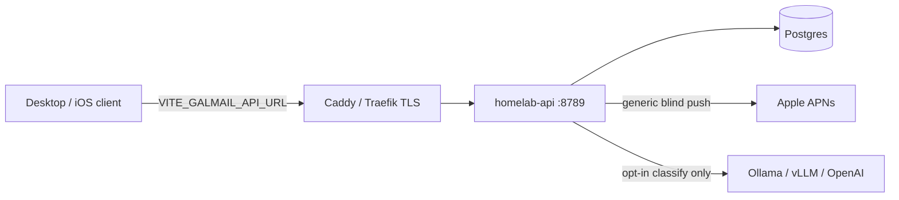

# GalMail homelab backend

Self-hosted stack for push device registration, remote opt-in consent sync, and
optional AI classify. **Mail sync stays on the client** (Gmail / Graph); this
plane never becomes a full mail server.

Production Cloudflare Workers (`services/blind-relay`,
`services/opt-in-processor`) remain the future edge option. This compose stack
is the **homelab-first** path: Postgres + one Bun API, no Redis for v1.

## Architecture



| Service    | Role                                                                 |
| ---------- | -------------------------------------------------------------------- |
| `postgres` | Device tokens, consent rows, optional retained classify inputs       |
| `api`      | BFF: health, devices, push test, consent, AI classify                |

Skipped for v1: Redis queues, full ciphertext sync/R2, Gmail ingress webhook
parity with Cloudflare Workers.

## Quick start

```bash
# from repo root
cp deploy/homelab/.env.example deploy/homelab/.env
# edit ACCOUNT_AUTH_SECRET, API_ADMIN_TOKEN, POSTGRES_PASSWORD, APNs, AI

docker compose -f deploy/homelab/docker-compose.yml --env-file deploy/homelab/.env up -d --build

curl -s http://127.0.0.1:8789/health | jq
curl -s http://127.0.0.1:8789/openapi.json | jq
```

Mint a lab account token and register a device:

```bash
TOKEN=$(curl -s -X POST http://127.0.0.1:8789/v1/dev/token \
  -H "x-galmail-admin-token: $API_ADMIN_TOKEN" \
  -H "content-type: application/json" \
  -d '{"accountId":"acct_homelab_01"}' | jq -r .token)

curl -s -X POST http://127.0.0.1:8789/v1/devices \
  -H "authorization: Bearer $TOKEN" \
  -H "content-type: application/json" \
  -d '{"deviceId":"device_lab_01","platform":"apns","pushToken":"<64+ hex APNs token>","sandbox":true}'
```

Send a generic blind test push (admin token; never puts mail content in APNs):

```bash
curl -s -X POST http://127.0.0.1:8789/v1/push/test \
  -H "x-galmail-admin-token: $API_ADMIN_TOKEN" \
  -H "content-type: application/json" \
  -d '{"deviceId":"device_lab_01"}'
```

Without APNs credentials, `/v1/push/test` returns `dryRun: true` so the API
still boots on a fresh homelab.

## Client configuration

Point the web/Tauri client at the public HTTPS origin (not the raw Docker
port) via sops / env:

| Variable                 | Purpose                                      |
| ------------------------ | -------------------------------------------- |
| `VITE_GALMAIL_API_URL`   | Homelab BFF base URL (this stack)            |
| `VITE_GALMAIL_RELAY_URL` | Existing Cloudflare/local Wrangler relay     |
| `GALMAIL_OPTIN_URL`      | Existing Workers opt-in processor            |

Example: `VITE_GALMAIL_API_URL=https://galmail.example.com`

`packages/remote-opt-in` exports `HttpRemoteOptInService` for consent sync
against `/v1/accounts/:accountId/consent`.

## Routes

| Method | Path                                 | Auth              |
| ------ | ------------------------------------ | ----------------- |
| GET    | `/health`                            | none              |
| GET    | `/openapi.json`                      | none              |
| POST   | `/v1/devices`                        | Bearer account    |
| GET    | `/v1/devices`                        | Bearer account    |
| DELETE | `/v1/devices/:deviceId`              | Bearer account    |
| POST   | `/v1/push/test`                      | `x-galmail-admin-token` |
| GET    | `/v1/accounts/:accountId/consent`    | Bearer account    |
| PUT    | `/v1/accounts/:accountId/consent`    | Bearer account    |
| DELETE | `/v1/accounts/:accountId/consent`    | Bearer account    |
| POST   | `/v1/ai/classify`                    | Bearer + `x-galmail-account-id` |
| POST   | `/v1/dev/token`                      | admin (lab only)  |

Account JWTs use `aud=galmail-homelab` (distinct from Cloudflare Workers'
`galmail-hosted`).

## Apple / iOS push checklist

1. Apple Developer account with App ID `com.galateacorp.mail` (and NSE/share
   suffixes per `docs/platform-expansion.md`).
2. Enable **Push Notifications** on the App ID.
3. Create an **APNs Auth Key** (.p8). Record Key ID, Team ID, and private key.
4. Set `APNS_TOPIC` to the app bundle ID (`com.galateacorp.mail`).
5. Use `APNS_SANDBOX=true` for development / TestFlight until you cut over to
   production APNs (`api.push.apple.com`).
6. Provision signing team, App Group `group.com.galateacorp.mail`, and Keychain
   group locally (do not commit personal profiles).
7. Validate on a physical device: token registration -> `/v1/devices` ->
   `/v1/push/test` -> generic alert / NSE blind enrichment.

Android FCM is stubbed (`FCM_ENABLED=false`). Registering `platform: "fcm"`
returns 501 until you wire credentials.

## AI / remote processing

- Consent must match `CONSENT_DISCLOSURE_VERSION` (same string as
  `REMOTE_OPT_IN_DISCLOSURE_VERSION` in `@galmail/remote-opt-in`).
- `/v1/ai/classify` refuses work without enabled consent.
- Retention `0` = process-and-discard. Positive hours keep subject/snippet JSON
  until expiry, then purge.
- Point `OPENAI_API_BASE` at homelab Ollama (`.../v1`) or any OpenAI-compatible
  gateway. Rules-based classify still works if the LLM is down.

## Reverse proxy notes

- Terminate TLS at Caddy/Traefik; keep compose ports on `127.0.0.1`.
- See `Caddyfile.example`. Prefer Tailscale / LAN-only exposure for early
  homelab.
- Do not put APNs `.p8` material or `ACCOUNT_AUTH_SECRET` in the client.

## Relation to Cloudflare Workers

| Surface        | Homelab (`deploy/homelab`)     | Cloudflare (existing)              |
| -------------- | ------------------------------ | ---------------------------------- |
| Blind push     | APNs test + device registry    | Full relay, queues, Web Push, R2   |
| Opt-in / AI    | Consent + classify scaffold    | Token encryption, revocation queue |
| Deploy         | `docker compose up`            | Wrangler + D1/R2                   |

Use Workers when you want a managed edge; use this compose when you want the
same product surfaces on your own metal first.

## Local package (without Docker)

```bash
# Postgres must be reachable via DATABASE_URL
z services/homelab-api
bun install
cp ../../deploy/homelab/.env.example .env   # or export vars
bun run dev
```
